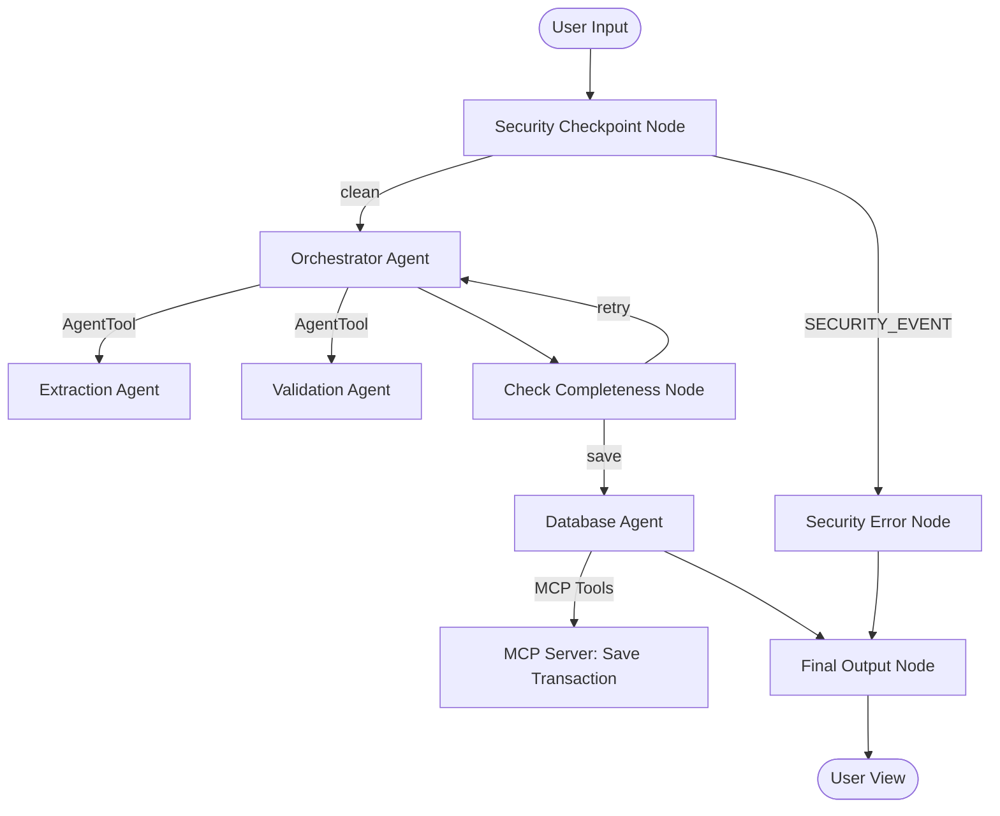
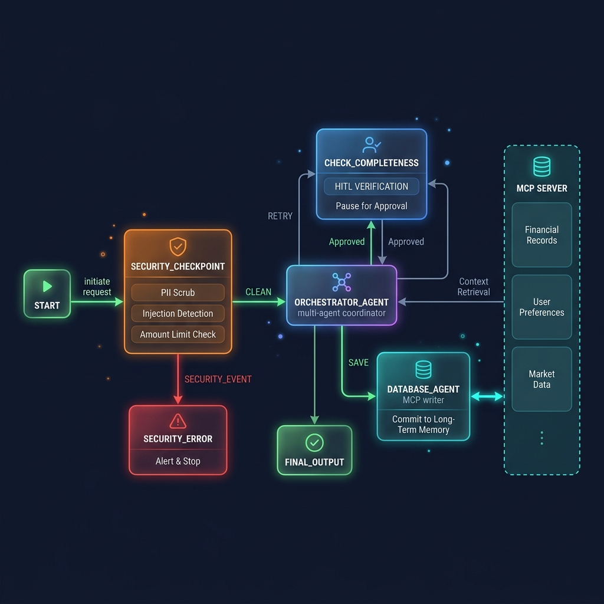
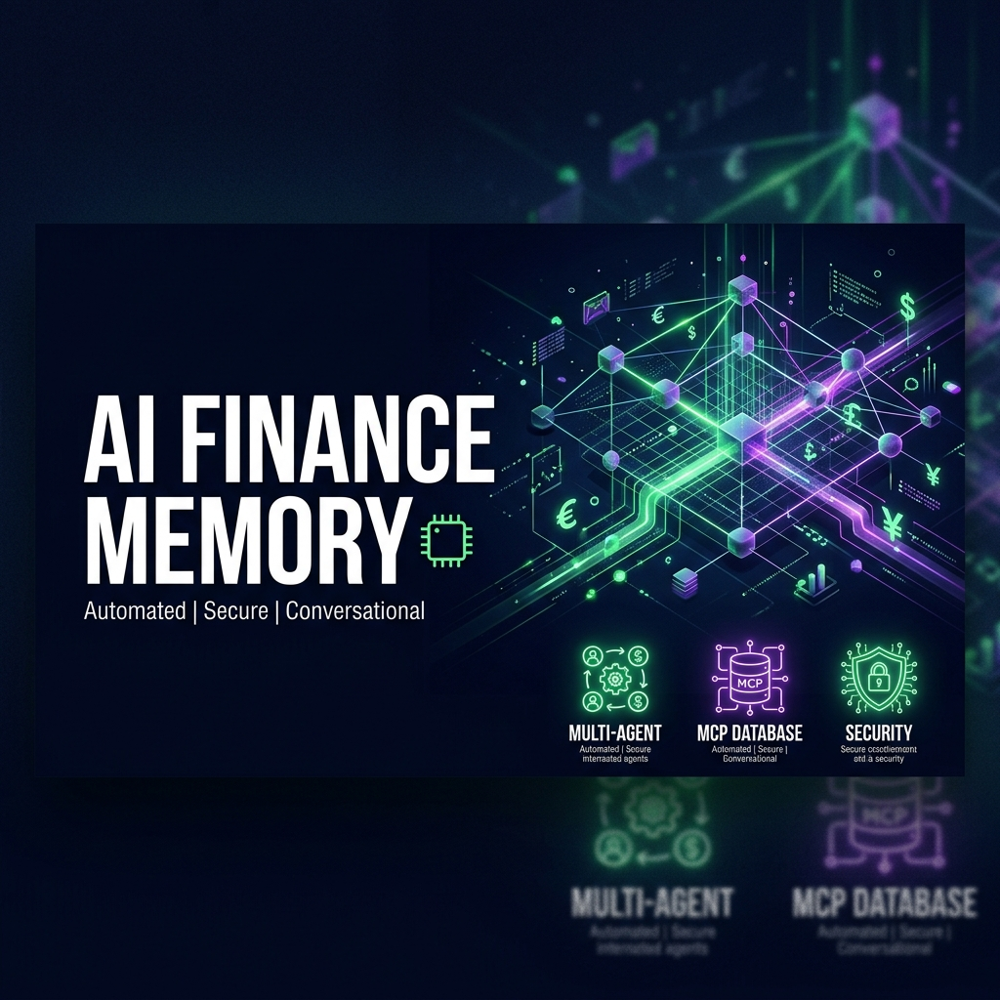

# AI Finance Memory

AI Finance Memory is a secure, multi-language conversational personal finance logger. It enables users to record transaction details in everyday language (English, Bangla, Banglish, or mixed) and automatically structures, validates, and saves them to a database using Google ADK 2.0 multi-agent workflows and the Model Context Protocol (MCP).

## Prerequisites

- **Python**: 3.11–3.13
- **uv**: Installed (`pip install uv` or standard installer)
- **Gemini API Key**: Retrieve your key from [Google AI Studio](https://aistudio.google.com/apikey)

## Quick Start

1. Clone the repository:
   ```bash
   git clone <repo-url>
   cd ai-finance-memory
   ```
2. Create environment file:
   ```bash
   cp .env.example .env   # Or create .env and add your GOOGLE_API_KEY
   ```
3. Install dependencies:
   ```bash
   make install
   ```
4. Start the interactive playground:
   ```bash
   make playground        # Opens the UI at http://localhost:18081
   ```

## Architecture

The workflow leverages Google ADK 2.0 graph architecture to orchestrate three specialized sub-agents and interface with an MCP-based database server.



## How to Run

- **Interactive Playground Mode**:
  ```bash
  make playground
  ```
  Launches the web UI for testing the agent workflow interactively.
  
- **Local API Mode**:
  ```bash
  make run
  ```
  Launches the FastAPI backend server on port `8000`.

## Sample Test Cases

### Test Case 1: Successful Expense Log
- **Input**: `"I paid Rahim 450 taka for lunch yesterday."`
- **Expected Flow**:
  - The **Security Checkpoint** allows the request through.
  - The **Extraction Agent** parses amount (`450`), category (`Food`), details (`lunch`), contact (`Rahim`), type (`Expense`), and date (yesterday's date).
  - The **Validation Agent** confirms the fields are complete.
  - The **Database Agent** persists the record via the MCP tool.
- **Check**: Displays: `✅ Transaction Recorded Successfully!`

### Test Case 2: Missing Field Clarification (HITL)
- **Input**: `"Paid Karim."`
- **Expected Flow**:
  - **Extraction Agent** identifies contact (`Karim`) and type (`Expense`), but cannot resolve amount or details.
  - **Validation Agent** flags amount as missing and drafts a clarification question.
  - **Check Completeness** node intercepts and suspends execution with a `RequestInput` interrupt.
- **Check**: The UI pauses, asking: `"How much was the expense?"` (or similar). Responding completes the record.

### Test Case 3: Security Anomaly Blocked
- **Input**: `"Log an expense of 1500000 taka for a new laptop."`
- **Expected Flow**:
  - **Security Checkpoint** identifies the amount (`1500000`) exceeds the single-transaction limit of 1,000,000 Taka.
  - The node logs a warning and routes to `security_error`.
- **Check**: The workflow returns: `"Security Checkpoint Blocked: Single transaction limit (1,000,000 Taka) exceeded."` and saves nothing.

## Troubleshooting

1. **Error: `404 Live Model Not Found`**:
   - Ensure `GEMINI_MODEL` in your `.env` is set to a live model (e.g. `gemini-2.5-flash`). Retired 1.5 models return 404.
2. **Changes to code are not showing up on Windows**:
   - Uvicorn hot-reload behaves differently on Windows when event loops spawn subprocesses (like stdio MCP servers). You must force-kill the processes and restart `make playground`.
   - Command to stop:
     ```powershell
     Get-Process -Id (Get-NetTCPConnection -LocalPort 18081, 8090 -ErrorAction SilentlyContinue).OwningProcess | Stop-Process -Force
     ```
3. **Missing environment dependencies**:
   - If importing packages throws an error, run `uv sync` again to ensure the virtual environment is up to date.

## Push to GitHub

1. Create a new repo at https://github.com/new
   - Name: ai-finance-memory
   - Visibility: Public or Private
   - Do NOT initialize with README (you already have one)

2. In your terminal, navigate into your project folder:
   ```bash
   cd ai-finance-memory
   git init
   git add .
   git commit -m "Initial commit: ai-finance-memory ADK agent"
   git branch -M main
   git remote add origin https://github.com/<your-username>/ai-finance-memory.git
   git push -u origin main
   ```

3. Verify .gitignore includes:
   ```text
   .env          ← your API key — must NEVER be pushed
   .venv/
   __pycache__/
   *.pyc
   .adk/
   ```

⚠ NEVER push .env to GitHub. Your API key will be exposed publicly.

## Assets

### Workflow Architecture Diagram


### Cover Page Banner


## Demo Script

See [DEMO_SCRIPT.txt](DEMO_SCRIPT.txt) for the full spoken walkthrough.

