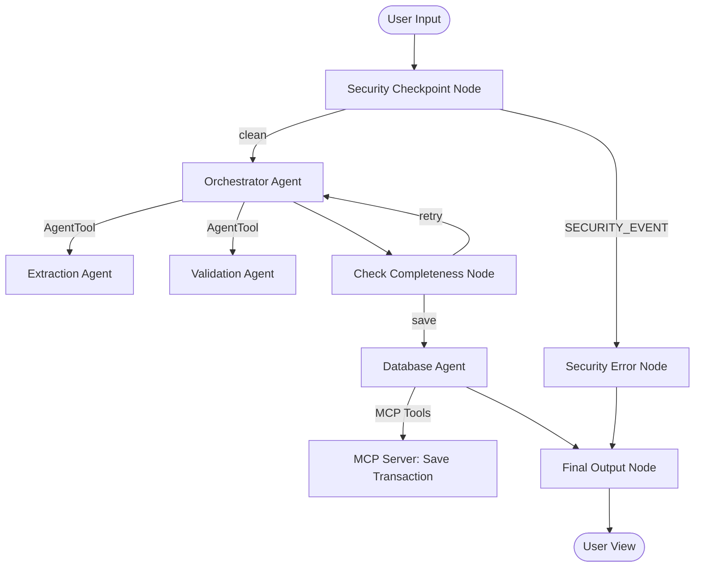

# Submission Write-Up: AI Finance Memory

## Problem Statement

Logging daily financial transactions is crucial for personal financial health, yet most existing solutions require users to navigate complex, field-heavy forms. This creates high friction and discourages consistent logging. AI Finance Memory solves this by enabling users to speak or write transaction logs in their natural conversational language (including mixed languages like Bangla, Banglish, and English) and having a multi-agent system securely extract, validate, and save those transactions.

## Solution Architecture

## Concepts Used

1. **ADK Workflow**: The entire system is built as an ADK 2.0 `Workflow` graph, separating security checks, core orchestration, validation decisions, database writes, and final response rendering into discrete nodes (implemented in [`app/agent.py`](file:///e:/my_world/my_folder/projects/Manager_Saab_3/ai-finance-memory/app/agent.py)).
2. **LlmAgent**: Specialized agents are used to split reasoning loads. We define `extraction_agent`, `validation_agent`, `database_agent`, and `orchestrator_agent` using LlmAgent configurations.
3. **AgentTool**: The `orchestrator_agent` invokes the specialized sub-agents via `AgentTool(extraction_agent)` and `AgentTool(validation_agent)`, letting it coordinate data extraction and verification.
4. **MCP Server**: Stdio-based local MCP server in [`app/mcp_server.py`](file:///e:/my_world/my_folder/projects/Manager_Saab_3/ai-finance-memory/app/mcp_server.py) implements three tools: `save_transaction`, `list_transactions`, and `get_db_summary`.
5. **Security Checkpoint**: The initial function node `security_checkpoint` runs input sanitation, checks for injection patterns, redacts PII (email/phones), and enforces a domain rule (max amount limit).
6. **Agents CLI**: Project scaffolded and managed using `agents-cli scaffold`.

## Security Design

- **PII Scrubbing**: Sanitizes input strings before they reach downstream LLMs. This is crucial to ensure that third-party contact phone numbers or emails mentioned in a transaction do not get sent to LLM endpoints.
- **Prompt Injection Guard**: Detects adversarial commands like "ignore instruction" to prevent users from manipulating the agent's behavior or bypassing the logic.
- **Domain Anomaly Detection**: Rejects any transaction claiming to be larger than 1,000,000 Taka. This mitigates errors from typos (e.g., adding too many zeros) and prevents logging malicious transaction figures.
- **Structured Audit Logs**: Every security decision, anomaly, and save operation is logged to standard error as structured JSON with distinct severity levels (`INFO`, `WARNING`, `CRITICAL`), providing a clear trace for ops.

## MCP Server Design

Our stdio-based Model Context Protocol (MCP) server implements local file persistence using `transactions.json`:
- **`save_transaction`**: Persists a validated transaction record (containing ID, date, type, amount, category, details, contact, and due status).
- **`list_transactions`**: Retrieves list of logs with optional type filters.
- **`get_db_summary`**: Computes total income, expense, net balance, and record counts.

By separating database logic into an MCP server, the agent's core code remains clean, and database access is decoupled and easily swappable (e.g. for PostgreSQL or Firestore) in production.

## Human-in-the-Loop (HITL) Flow

If the `Validation Agent` detects missing critical fields (such as `amount`), it yields a `RequestInput(interrupt_id="clarification", message="...")` in the `check_completeness` node. This suspends the workflow run and returns the clarification question to the user in the UI. When the user responds, the `check_completeness` node resumes, updates the state with the clarification text, and loops back to the orchestrator to re-run extraction and validation. This ensures clean, verified data is saved only after all requirements are met.

## Demo Walkthrough

The workflow has been tested using three distinct pathways:
1. **Happy Path**: The user logs a complete transaction: `"I paid Rahim 450 taka for lunch yesterday."` The system extracts the metadata, passes validation, calls the MCP tool to persist it, and outputs a formatted success message.
2. **Clarification Path**: The user logs: `"Paid Karim."` The validator alerts that the amount is missing, prompting the user: `"How much was the expense?"`. Once the user enters the amount, the workflow resumes and saves the transaction.
3. **Blocked Path**: The user logs: `"Log an expense of 1500000 taka."` The security checkpoint detects the value exceeds the 1,000,000 limit, logs a warning, and immediately terminates with a security blockage.

## Impact / Value Statement

AI Finance Memory removes the form-filling fatigue of tracking daily expenses and borrowing. By leveraging conversational AI, it increases user engagement and logging frequency, while maintaining enterprise-level security, structured storage, and full audit logs.
